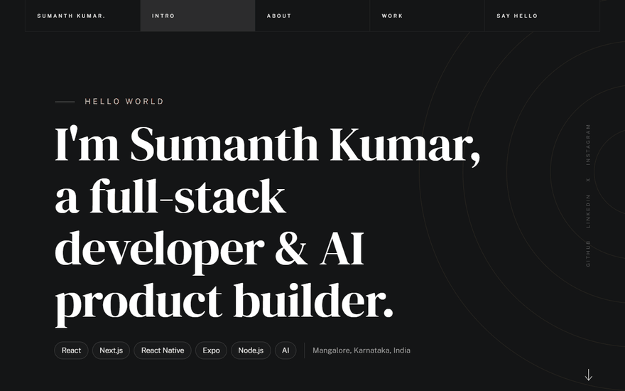
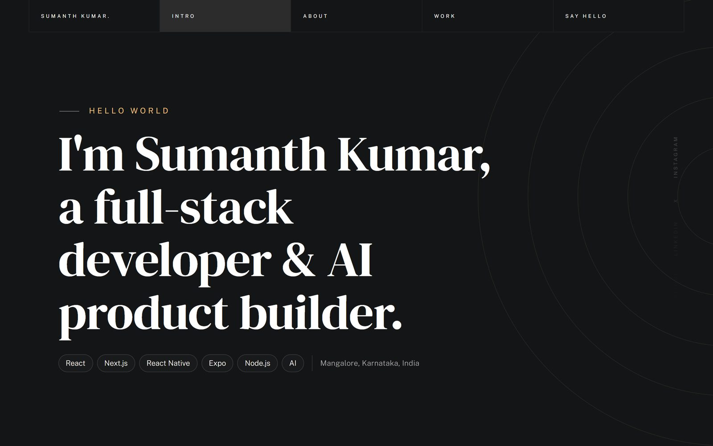
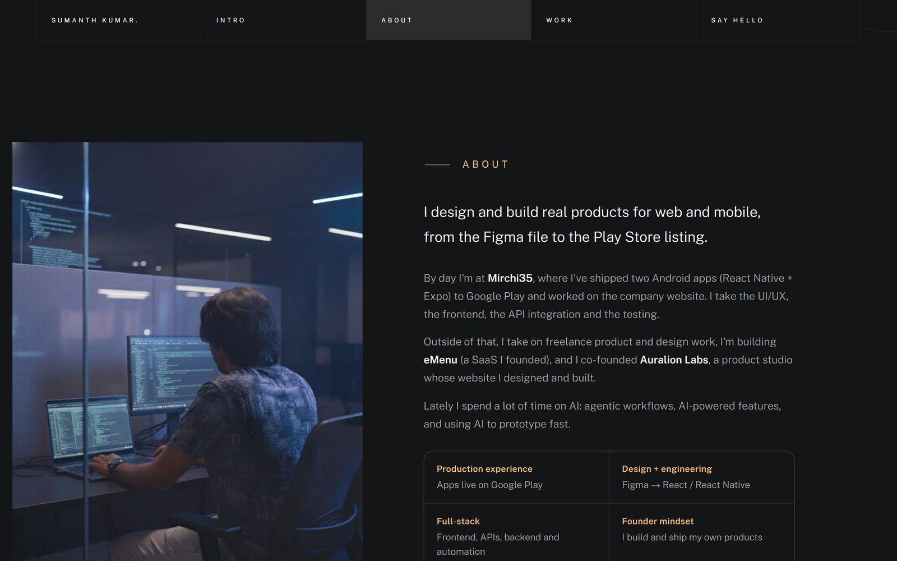
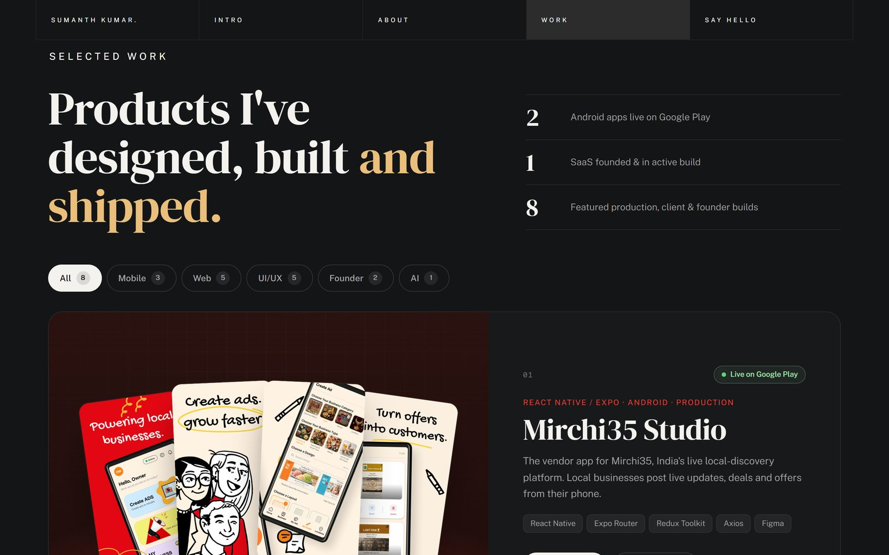
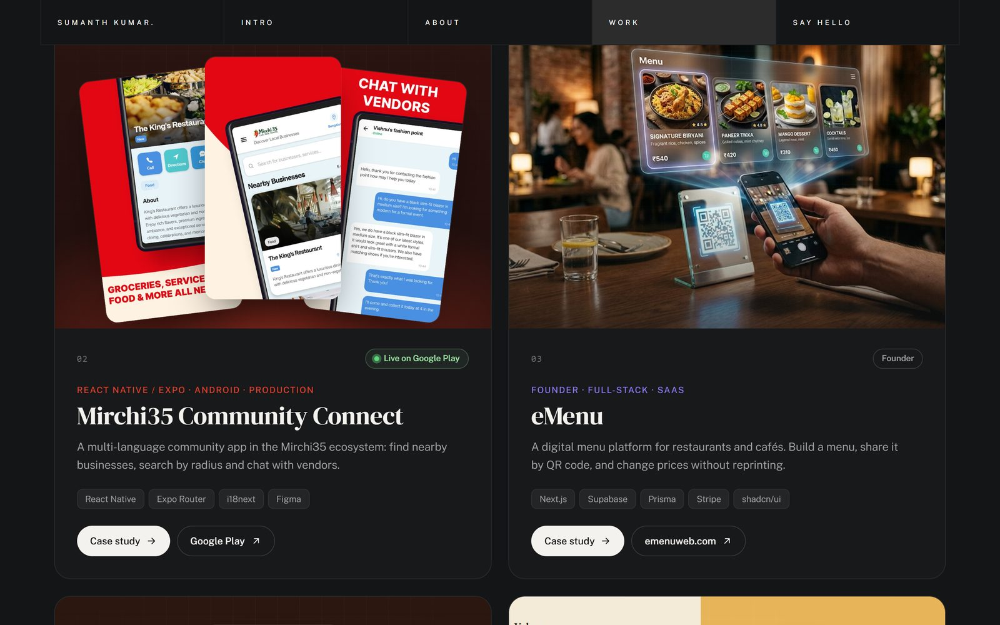
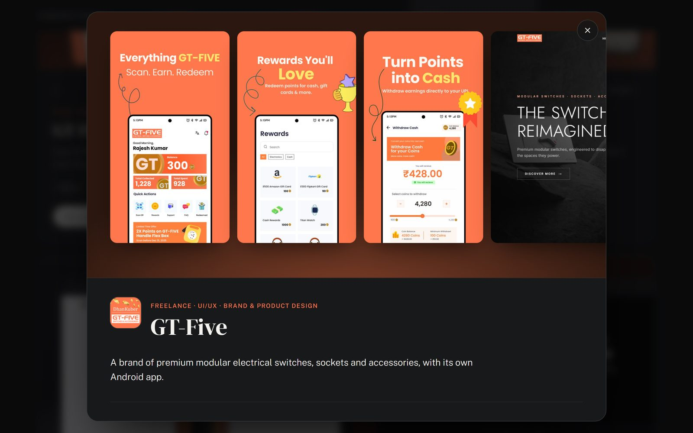
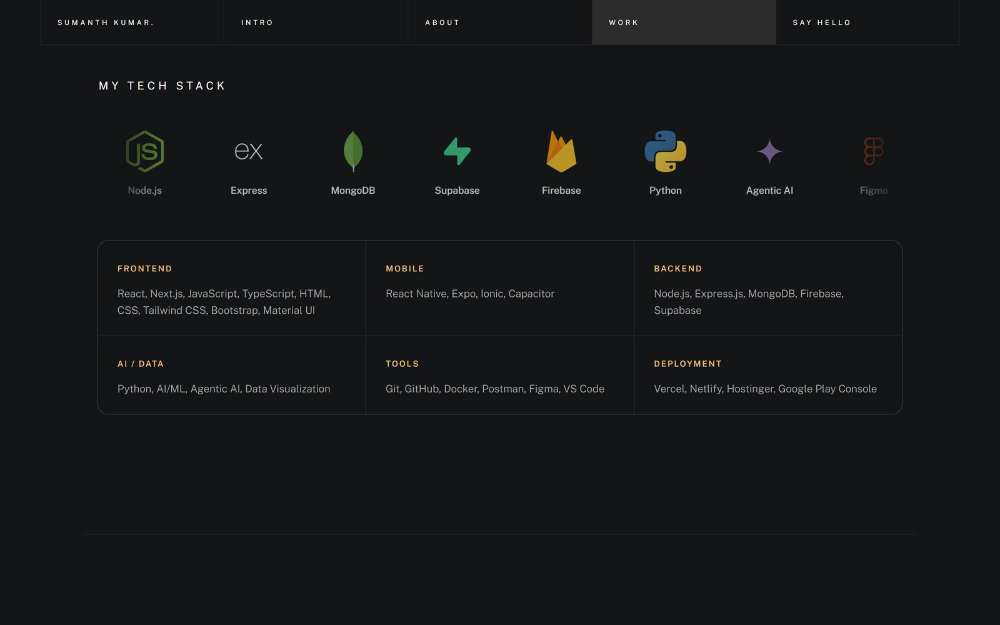
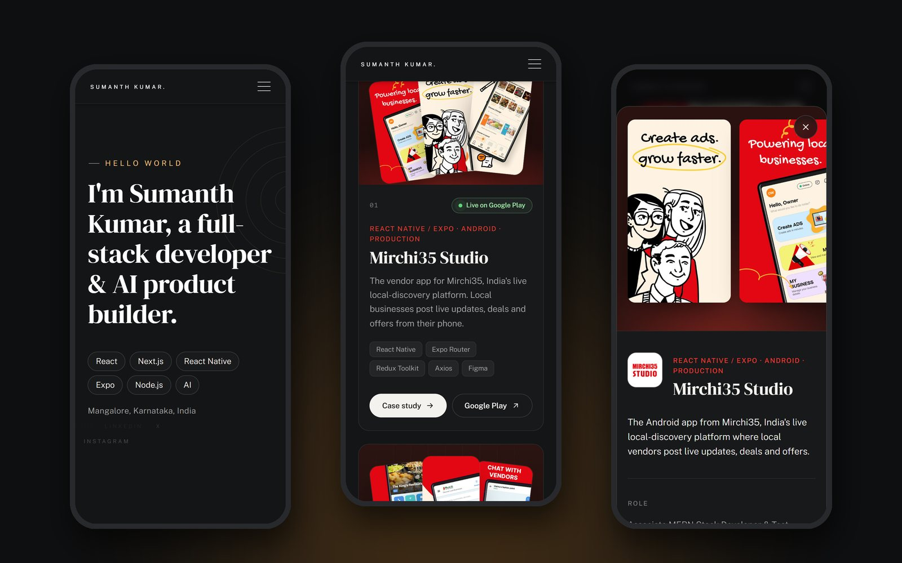
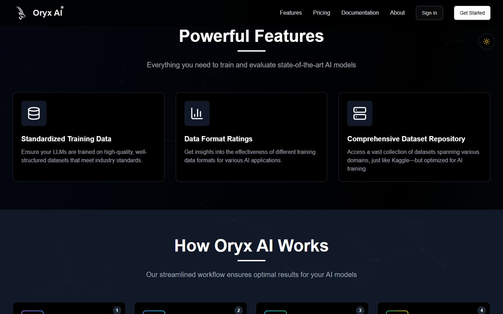
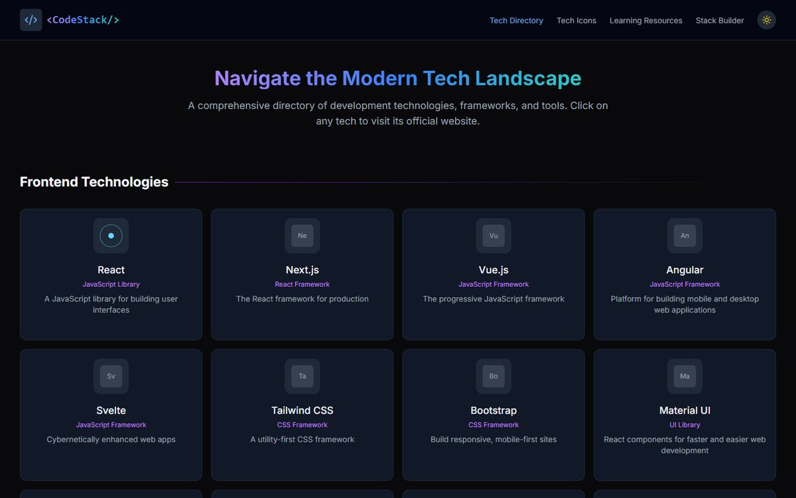

<!-- Header -->
<p align="center">
  
</p>

<p align="center">
  <a href="https://sumanth-kumar-portfolio.vercel.app/">
    
  </a>
</p>

<p align="center">
  <a href="https://sumanth-kumar-portfolio.vercel.app/"></a>
  <a href="https://play.google.com/store/apps/details?id=com.mirchi35.studio"></a>
  <a href="https://www.linkedin.com/in/sumanth-kumar-230194294"></a>
  <a href="mailto:sumanth.k.0202@gmail.com"></a>
</p>

<br />

<p align="center">
  <a href="https://sumanth-kumar-portfolio.vercel.app/">
    
  </a>
</p>

---

## About

I design and build real products for web and mobile, from the Figma file to the Play Store listing.

By day I'm an **Associate MERN Stack Developer & Test Engineer at Mirchi35**, where I've shipped two Android apps (React Native + Expo) to Google Play and worked on the company website, owning the UI/UX, frontend, API integration and testing. Alongside that I take on freelance product and design work, I'm building **[eMenu](https://emenuweb.com/)** (a SaaS I founded), and I co-founded **[Auralion Labs](https://auralionlabs.com/)**, a product studio whose website I designed and built.

Lately I spend a lot of time on AI: agentic workflows, AI-powered features, and using AI to prototype fast.

| | |
|---|---|
| **Production experience** | Apps live on Google Play |
| **Design + engineering** | Figma → React / React Native |
| **Full-stack** | Frontend, APIs, backend and automation |
| **Founder mindset** | I build and ship my own products |

---

## Screenshots

<table>
  <tr>
    <td width="50%"></td>
    <td width="50%"></td>
  </tr>
  <tr>
    <td align="center"><sub><b>Hero</b> · identity, focus and stack at a glance</sub></td>
    <td align="center"><sub><b>About</b> · what I do and what I bring</sub></td>
  </tr>
  <tr>
    <td width="50%"></td>
    <td width="50%"></td>
  </tr>
  <tr>
    <td align="center"><sub><b>Selected Work</b> · stats and category filters</sub></td>
    <td align="center"><sub><b>Project cards</b> · real store screenshots and live site captures</sub></td>
  </tr>
  <tr>
    <td width="50%"></td>
    <td width="50%"></td>
  </tr>
  <tr>
    <td align="center"><sub><b>Case study</b> · role, scope, features, tech and links</sub></td>
    <td align="center"><sub><b>Tech stack</b> · marquee and grouped skills</sub></td>
  </tr>
</table>

<p align="center">
  
  <br />
  <sub><b>Mobile</b> · fully responsive, with the case study as a bottom sheet</sub>
</p>

---

## Featured work

| # | Project | What it is | My role | Stack | Link |
|:-:|---|---|---|---|---|
| 01 | **Mirchi35 Studio** | Vendor app for India's live local-discovery platform | UI/UX, React Native frontend, testing, Play Store launch | React Native · Expo Router · Redux Toolkit | [Google Play](https://play.google.com/store/apps/details?id=com.mirchi35.studio) |
| 02 | **Mirchi35 Community Connect** | Multi-language community app in the Mirchi35 ecosystem | UI/UX, React Native frontend, API integration, deployment | React Native · Expo Router · i18next | [Google Play](https://play.google.com/store/apps/details?id=com.mirchi35.pulse) |
| 03 | **eMenu** | Digital menu SaaS for restaurants, shared by QR | Founder: design and build | Next.js · Supabase · Prisma · Stripe | [emenuweb.com](https://emenuweb.com/) |
| 04 | **GT-Five** | Premium modular switches brand with an Android app | Freelance app UI/UX, logo, posters, banners | Figma | [Google Play](https://play.google.com/store/apps/details?id=com.gtfive.gtfive_app) · [gtfive.com](https://gtfive.com/) |
| 05 | **Scavenge** | Platform for real-world scavenger hunts: GPS tracking, live leaderboards, QR challenges | Full-stack development | React · Node.js · Maps API | [scavenge.rs](https://scavenge.rs/) |
| 06 | **Auralion Labs** | Product studio for AI, web, mobile and SaaS | Co-founder; designed and built the website | Next.js · GSAP · Sanity CMS | [auralionlabs.com](https://auralionlabs.com/) |
| 07 | **Mirchi35 Website** | Marketing site for the Mirchi35 platform | Frontend: UI, responsive build, optimization | Next.js · TypeScript · Tailwind CSS | [mirchi35.com](https://mirchi35.com/) |
| 08 | **Wren** | Agentic waiting-room assistant for GP clinics *(hackathon prototype)* | Patient and clinician interfaces, speech input | Gemini · Google ADK · Cloud Run · Firestore | [Devpost](https://allthingsagentichackathon.devpost.com/) |

<details>
<summary><b>More projects</b></summary>
<br />

<table>
  <tr>
    <td width="50%"><a href="https://oryx-ai.vercel.app/"></a></td>
    <td width="50%"><a href="https://codestack-sigma.vercel.app/"></a></td>
  </tr>
  <tr>
    <td align="center"><sub><b>Oryx AI</b></sub></td>
    <td align="center"><sub><b>Code Stack</b></sub></td>
  </tr>
</table>

- **[Vakya](https://vakya.fun/)**: a Bhagavad Gita verse on your lock screen, every day; landing page design and build (Next.js, GSAP, Motion)
- **[Oryx AI](https://oryx-ai.vercel.app/)**: training datasets and evaluation tools for AI/LLM models (Node.js, React, Python, Tailwind CSS)
- **[Code Stack](https://codestack-sigma.vercel.app/)**: open-source directory of developer tools (Next.js, TypeScript, React, Tailwind CSS)
- **[image-π](https://image-pi-dusky.vercel.app/)**: privacy-first image toolkit that runs in the browser
- **[Salary Split](https://salary-split-three.vercel.app/)**: salary budgeting visualization (React)
- **[Terminal Portfolio](https://terminal-portfolio-seven-kohl.vercel.app/)**: a portfolio you navigate by command line

</details>

---

## Experience

| Role | Company | When |
|---|---|---|
| **Associate MERN Stack Developer & Test Engineer** | Mirchi35 Private Limited | Nov 2025 – Present |
| **Freelance Full-stack Developer & UI/UX Designer** | Part-time, alongside Mirchi35 | Present |
| **Founder** · eMenu &nbsp;/&nbsp; **Co-founder** · Auralion Labs | — | Present |
| **Frontend Programmer (MEAN Stack)** | Ants Applied DataScience | Nov 2023 – Feb 2025 |
| **Assistant Software Programmer (Intern)** | Ants Applied DataScience | Mar 2023 – Oct 2023 |

**Education** · BCA in Artificial Intelligence & Machine Learning, Manipal University Jaipur (Online), Sep 2024 – 2027 (expected) · Diploma in Computer Science & Engineering, S J Government Polytechnic, 2021 – 2023 (GPA 9.0)

---

## Tech stack

<p>
  <br />
  <br />
  
</p>

| Area | Tools |
|---|---|
| **Frontend** | React, Next.js, JavaScript, TypeScript, HTML, CSS, Tailwind CSS, Bootstrap, Material UI |
| **Mobile** | React Native, Expo, Ionic, Capacitor |
| **Backend** | Node.js, Express.js, MongoDB, Firebase, Supabase |
| **AI / Data** | Python, AI/ML, Agentic AI, Data Visualization |
| **Tools** | Git, GitHub, Docker, Postman, Figma, VS Code |
| **Deployment** | Vercel, Netlify, Hostinger, Google Play Console |

---

## About this site

A fast, dependency-free static site: plain HTML, CSS and JavaScript, no build step.

- **Work section** with category filters (animated with the View Transitions API where supported), cursor-tracked card spotlights and per-project accent colours
- **Case studies** in a native `<dialog>`: focus handling, Escape and backdrop to close, and a bottom sheet on mobile
- **Real imagery**: Google Play store screenshots and live captures of each shipped site
- **Motion with restraint**: scroll reveals via `IntersectionObserver`, a seamless tech marquee, and full `prefers-reduced-motion` support
- **S2-K1, a droid assistant**: a scripted chat bot (no AI model, no network calls) that answers questions about projects, skills, experience and hiring, and can open any case study. Its face is a [Blobatar](https://blobatar.dev/) whose eyes follow the cursor and whose expression changes as it "thinks", and it chirps with original droid-style beeps synthesised live with the Web Audio API (mutable)
- **SEO-ready**: Open Graph and Twitter cards, canonical URL and `Person` structured data (JSON-LD)

### Run locally

There is no `package.json`; any static file server works.

```bash
git clone https://github.com/Skarycloud/SumanthKumar_Portfolio.git
cd SumanthKumar_Portfolio

npx serve .                 # or
python -m http.server 5500  # then open http://localhost:5500
```

Or open the folder in VS Code and use the **Live Server** extension.

### Project structure

```
├── index.html              # all content and sections
├── css/
│   ├── vendor.css          # third-party styles
│   ├── styles.css          # base theme (layout, typography, timeline)
│   ├── portfolio.css       # work section, case-study modal, overrides
│   └── chatbot.css         # S2-K1 chat window
├── js/
│   ├── plugins.js          # anime.js, MoveTo, etc.
│   ├── main.js             # preloader, nav, scroll spy, intro animation
│   ├── portfolio.js        # reveals, filters, spotlight, modal, marquee
│   ├── chatbot.js          # S2-K1: knowledge base, matcher, chat UI, droid sounds
│   └── vendor/blobatar/    # Blobatar (MIT), vendored, no CDN at runtime
├── images/
│   ├── projects/           # project covers and store screenshots
│   └── tech/               # tech stack icons
├── assets/                 # résumé (PDF)
└── docs/screenshots/       # README media
```

Deployed on **Vercel** as a static site.

---

## Let's talk

Have a product idea, need a web or mobile app, or want to build something with AI?

<p>
  <a href="mailto:sumanth.k.0202@gmail.com"></a>
  <a href="https://github.com/Skarycloud"></a>
  <a href="https://www.linkedin.com/in/sumanth-kumar-230194294"></a>
  <a href="https://x.com/SumanthKum75525"></a>
  <a href="https://www.instagram.com/skarycloud/"></a>
</p>

<p align="center">
  
</p>

<p align="center"><sub>© Sumanth Kumar · Mangalore, Karnataka, India</sub></p>
