<p align="center">
  <a href="https://sumanth-kumar-portfolio.vercel.app/">
    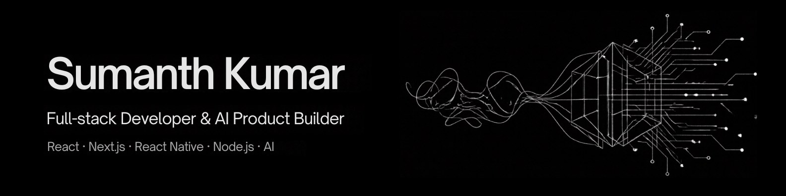
  </a>
</p>

<p align="center">
  <a href="https://sumanth-kumar-portfolio.vercel.app/">
    
  </a>
</p>

<p align="center">
  <a href="https://sumanth-kumar-portfolio.vercel.app/"></a>
  
  
  
</p>

<p align="center">
  <b>A hand-built portfolio: plain HTML, CSS and JavaScript, an animated story of how I work,<br />a droid assistant with an optional on-device AI brain, and every project I've shipped.</b>
</p>

<br />

<p align="center">
  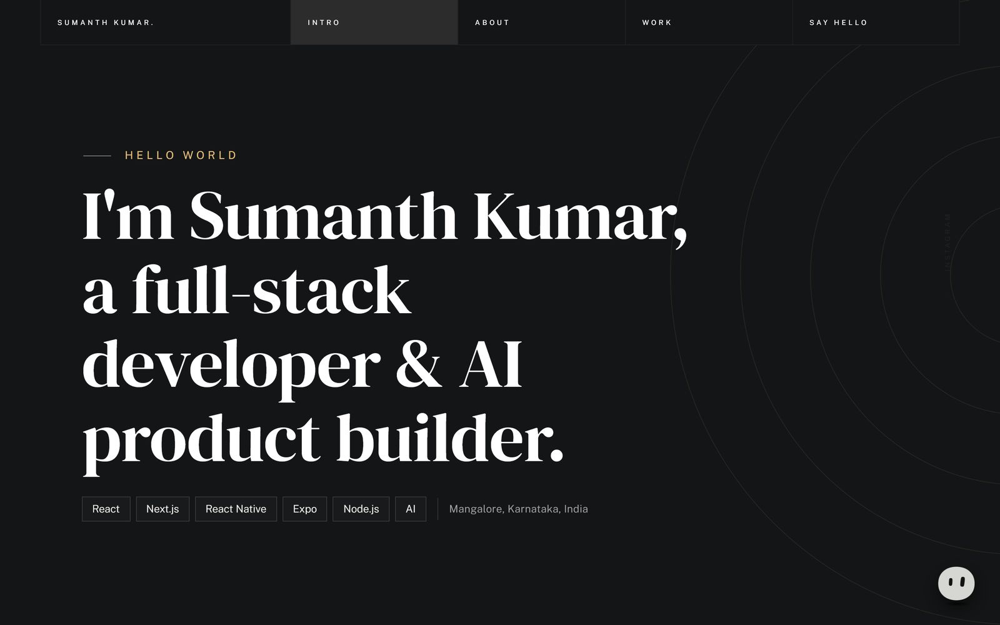
</p>

---

## ✦ Highlights

<table>
  <tr>
    <td colspan="2">
      <h3>The Build Loop: three ways I ship</h3>
      <p>The About section tells my process as live, interactive scenes. A switch picks the story and they rotate on their own: a <b>mobile app</b> designed in Figma, built in React Native and shipped to Google Play; a <b>website</b> built in Next.js, tuned to perfect Lighthouse scores and launched; and an <b>AI automation</b> where an agent qualifies a lead, updates the CRM, pings Slack and drafts the reply.</p>
      <table>
        <tr>
          <td width="33%">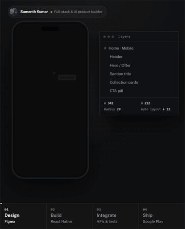</td>
          <td width="33%">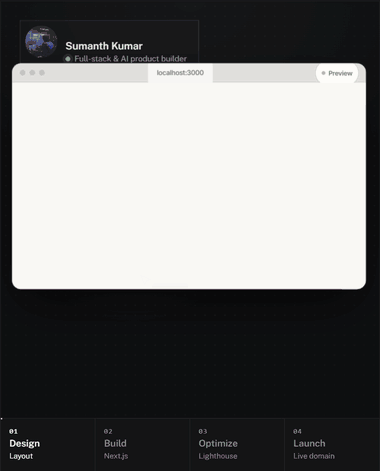</td>
          <td width="33%">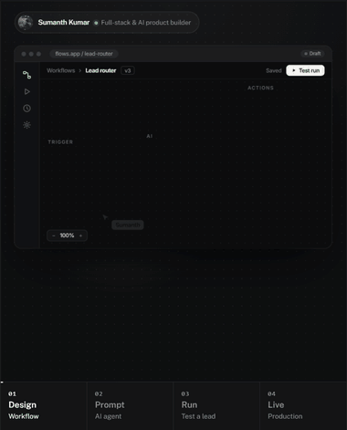</td>
        </tr>
        <tr>
          <td align="center"><sub><b>Mobile app</b> · Figma → React Native → APIs → Google Play</sub></td>
          <td align="center"><sub><b>Website</b> · Layout → Next.js → Lighthouse 100 → live</sub></td>
          <td align="center"><sub><b>AI automation</b> · Workflow → prompt → test run → production</sub></td>
        </tr>
      </table>
      <p><sub>Pure HTML/CSS · glass UI with studio-rendered product shots · each scene scales as one piece on any screen · click any step · pauses on hover and off-screen · still frames for reduced motion</sub></p>
    </td>
  </tr>
  <tr>
    <td width="50%">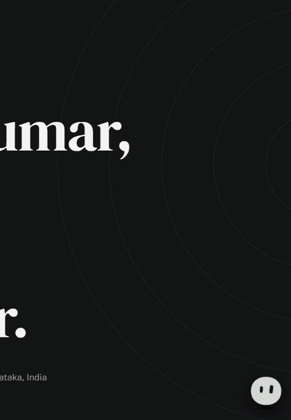</td>
    <td width="50%" valign="top">
      <h3>S2-K1, a droid assistant</h3>
      <p>Ask it anything about my work. Known questions get exact, hand-written answers; compliments and confusion get sentiment-aware replies, and its face reacts.</p>
      <p>Optionally it wakes a <b>local AI brain</b>: <a href="https://huggingface.co/onnx-community/LFM2.5-350M-ONNX">LFM2.5-350M</a> running <b>inside the browser</b> with Transformers.js + WebGPU. No server, no API key, messages never leave the device. Answers are grounded in portfolio facts and unsupported sentences are filtered out.</p>
      <p><sub>Blobatar face with cursor-tracking eyes · droid beeps synthesised with the Web Audio API (mutable)</sub></p>
    </td>
  </tr>
  <tr>
    <td width="50%" valign="top">
      <h3>Selected Work</h3>
      <p>Category filters with View Transitions, cursor-tracked card spotlights and per-project accents. Each project opens a <b>case study</b> with a draggable, momentum-scrolling gallery of real Play Store screenshots and live site captures.</p>
      <p><sub>Native &lt;dialog&gt; · keyboard &amp; screen-reader friendly · bottom sheet on mobile</sub></p>
    </td>
    <td width="50%">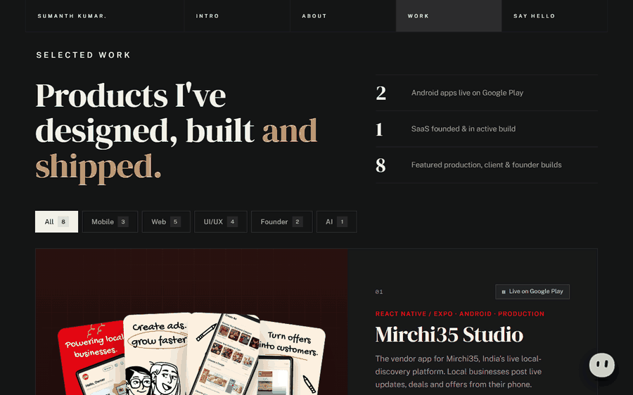</td>
  </tr>
</table>

---

## ✦ Screens

<table>
  <tr>
    <td width="50%">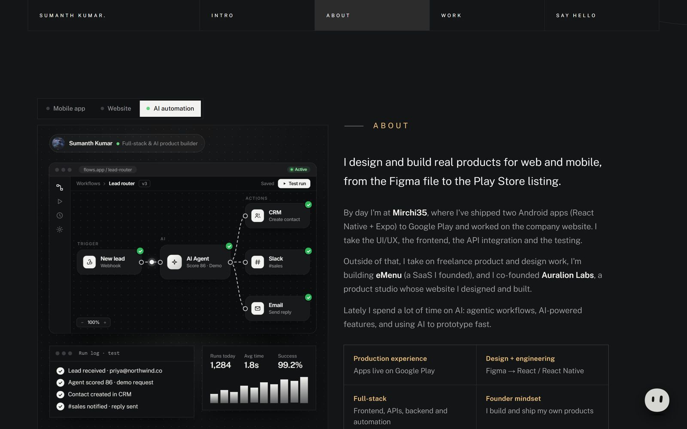</td>
    <td width="50%">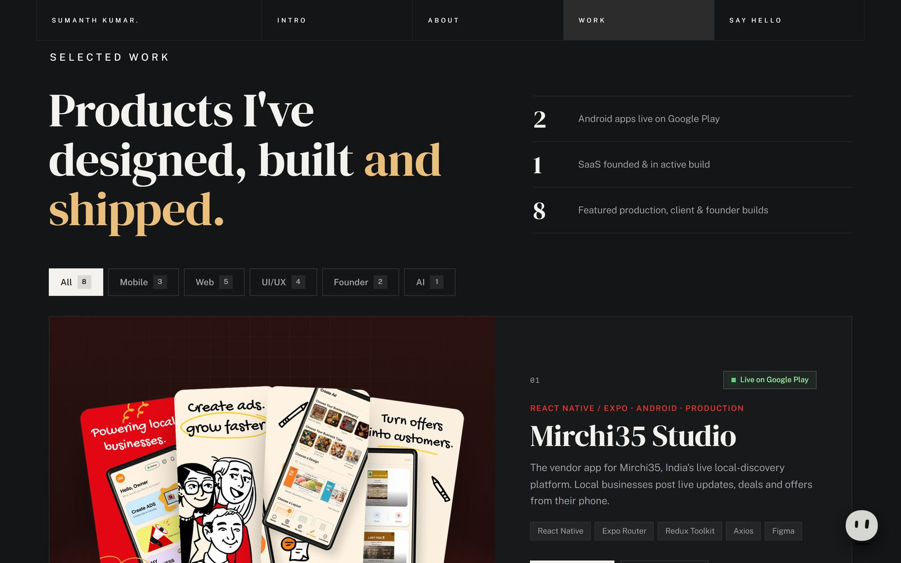</td>
  </tr>
  <tr>
    <td align="center"><sub><b>About</b> · the Build Loop next to the story</sub></td>
    <td align="center"><sub><b>Selected Work</b> · stats and filters</sub></td>
  </tr>
  <tr>
    <td width="50%">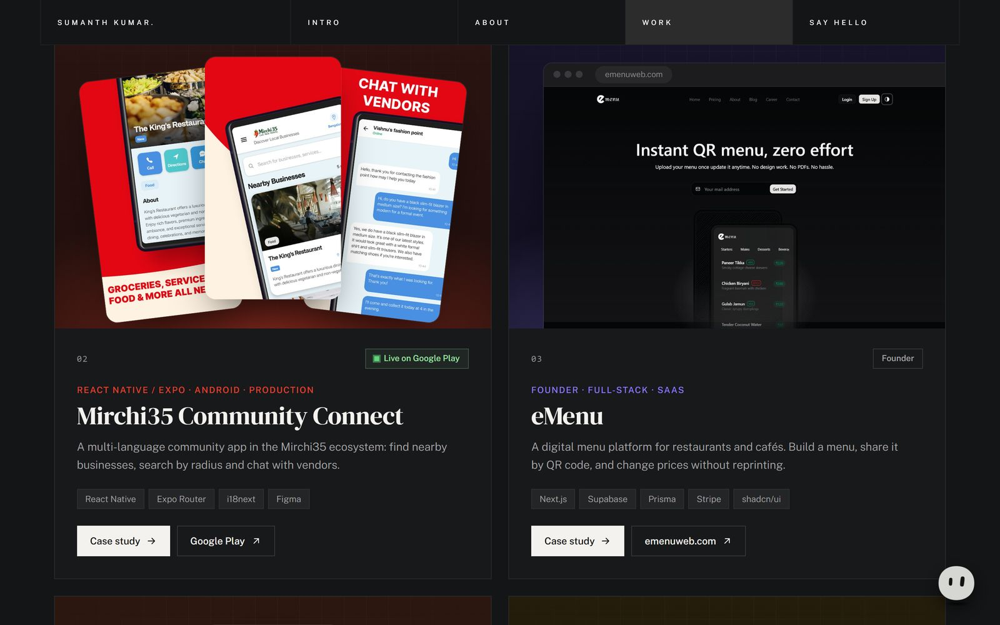</td>
    <td width="50%">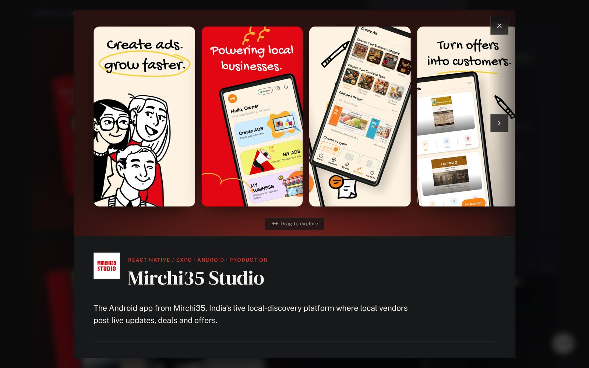</td>
  </tr>
  <tr>
    <td align="center"><sub><b>Project cards</b> · real screenshots</sub></td>
    <td align="center"><sub><b>Case study</b> · drag to explore</sub></td>
  </tr>
  <tr>
    <td width="50%">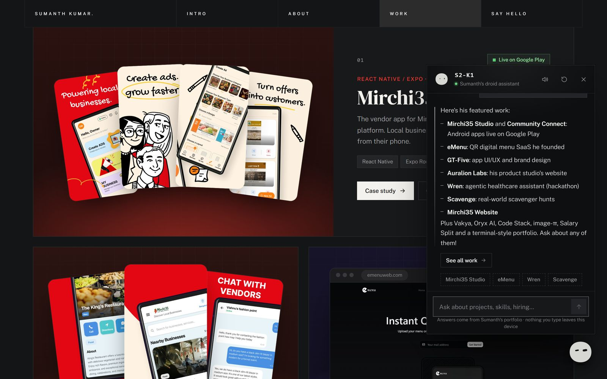</td>
    <td width="50%">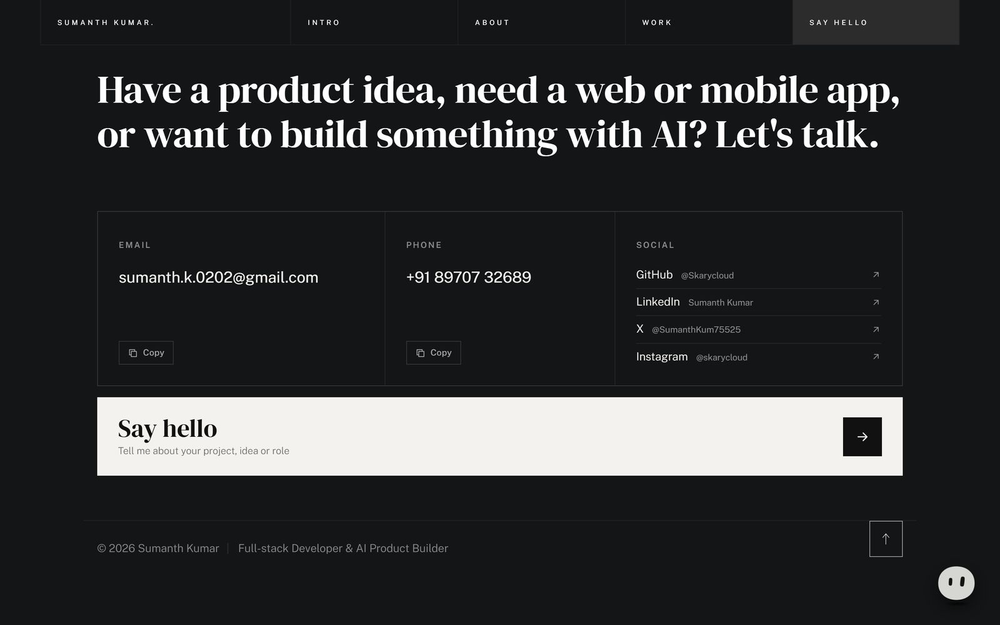</td>
  </tr>
  <tr>
    <td align="center"><sub><b>S2-K1</b> · answers with actions and suggestions</sub></td>
    <td align="center"><sub><b>Contact</b> · one-tap copy for email and phone</sub></td>
  </tr>
</table>

<table>
  <tr>
    <td width="68%">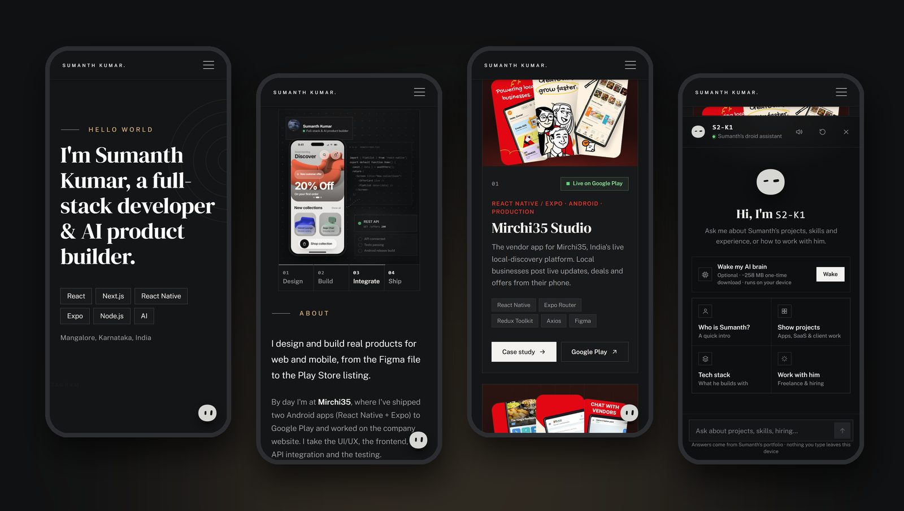</td>
    <td width="32%">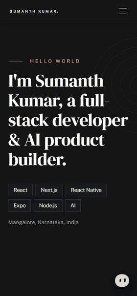</td>
  </tr>
  <tr>
    <td align="center"><sub><b>Mobile</b> · tested from 320px phones to 1920px desktops, landscape included</sub></td>
    <td align="center"><sub>Full scroll on a phone</sub></td>
  </tr>
</table>

---

## ✦ Featured work

| | Project | What it is | My role | Link |
|:-:|---|---|---|---|
| 01 | **Mirchi35 Studio** | Vendor app for a live local-discovery platform | UI/UX, React Native frontend, testing, Play Store launch | [Google Play](https://play.google.com/store/apps/details?id=com.mirchi35.studio) |
| 02 | **Mirchi35 Community Connect** | Multi-language community app | UI/UX, React Native frontend, API integration | [Google Play](https://play.google.com/store/apps/details?id=com.mirchi35.pulse) |
| 03 | **eMenu** | QR digital menu SaaS for restaurants | Founder: design and build | [emenuweb.com](https://emenuweb.com/) |
| 04 | **GT-Five** | Premium switches brand with an Android app | Freelance app UI/UX and brand graphics | [Google Play](https://play.google.com/store/apps/details?id=com.gtfive.gtfive_app) |
| 05 | **Scavenge** | Real-world scavenger hunts with GPS and leaderboards | Full-stack development | [scavenge.rs](https://scavenge.rs/) |
| 06 | **Auralion Labs** | Product studio for AI, web, mobile and SaaS | Co-founder; designed and built the website | [auralionlabs.com](https://auralionlabs.com/) |
| 07 | **Mirchi35 Website** | Marketing site for the platform | Frontend: UI, responsive build, optimization | [mirchi35.com](https://mirchi35.com/) |
| 08 | **Wren** | Agentic waiting-room assistant for GP clinics *(hackathon)* | Patient and clinician interfaces | [Devpost](https://allthingsagentichackathon.devpost.com/) |

<details>
<summary><b>More projects</b></summary>
<br />

[Vakya](https://vakya.fun/) · [Oryx AI](https://oryx-ai.vercel.app/) · [Code Stack](https://codestack-sigma.vercel.app/) · [image-π](https://image-pi-dusky.vercel.app/) · [Salary Split](https://salary-split-three.vercel.app/) · [Terminal Portfolio](https://terminal-portfolio-seven-kohl.vercel.app/)

</details>

---

## ✦ Built with care

| | |
|---|---|
| **Performance** | Lighthouse **91** mobile / **97** desktop, **100** best practices and SEO, about 180 KB on first load. Responsive WebP, deferred scripts, styles for the chat load with the chat, and the AI model only downloads when a visitor asks for it. |
| **Accessibility** | WCAG AA contrast, valid HTML, semantic heading order, keyboard-navigable tabs, dialogs and galleries, live-region announcements, and `prefers-reduced-motion` respected everywhere. |
| **Responsive** | Checked at 320, 360, 390, 430, 768, 820, 1024, 1280, 1440 and 1920px plus landscape phones: no horizontal scroll, nothing clipped. |
| **Privacy** | No analytics. The chat runs entirely in the browser; nothing typed is stored or sent. |
| **SEO** | Open Graph and Twitter cards, `Person` JSON-LD, canonical URL, `robots.txt`, `sitemap.xml`. Caching and security headers in `vercel.json`. |

### Stack

<p>
  
  &nbsp;·&nbsp;
  
  
  
  
  
</p>

<details>
<summary><b>What I work with day to day</b></summary>
<br />


React Native · Expo · Ionic · Capacitor · Material UI · Postman · Netlify · Google Play Console

</details>

---

## ✦ Run it locally

No install, no build step: any static server works.

```bash
git clone https://github.com/Skarycloud/SumanthKumar_Portfolio.git
cd SumanthKumar_Portfolio
npx serve .            # or: python -m http.server 5500
```

Or open the folder in VS Code and use **Live Server**. The optional AI brain needs a WebGPU browser (recent Chrome or Edge); add `?ai-debug` to the URL to see its raw and filtered output.

<details>
<summary><b>Project structure</b></summary>

```
├── index.html               all content and sections
├── css/
│   ├── styles.css           base theme (layout, typography, timeline)
│   ├── portfolio.css        work, case study, Build Loop, contact
│   └── chatbot.css          S2-K1 chat window
├── js/
│   ├── plugins.js           anime.js + MoveTo
│   ├── main.js              preloader, nav, scroll spy, intro animation
│   ├── portfolio.js         reveals, filters, modal, gallery, Build Loop, copy
│   ├── chatbot.js           S2-K1: knowledge, router, sentiment, UI, sounds
│   ├── ai/brain.js          local AI: support check, loading, streaming
│   ├── ai/worker.js         Web Worker running the model (Transformers.js)
│   └── vendor/blobatar/     Blobatar (MIT), vendored
├── images/                  project shots, Build Loop renders, tech icons
├── assets/                  résumé (PDF)
├── docs/media/              README media
└── vercel.json              caching + security headers
```

</details>

---

## ✦ Let's build something

Have a product idea, need a web or mobile app, or want to build something with AI?

<p>
  <a href="mailto:sumanth.k.0202@gmail.com"></a>
  <a href="https://www.linkedin.com/in/sumanth-kumar-230194294"></a>
  <a href="https://github.com/Skarycloud"></a>
  <a href="https://x.com/SumanthKum75525"></a>
  <a href="https://www.instagram.com/skarycloud/"></a>
</p>

<p align="center"><sub>Designed and built by Sumanth Kumar · Mangalore, India</sub></p>
